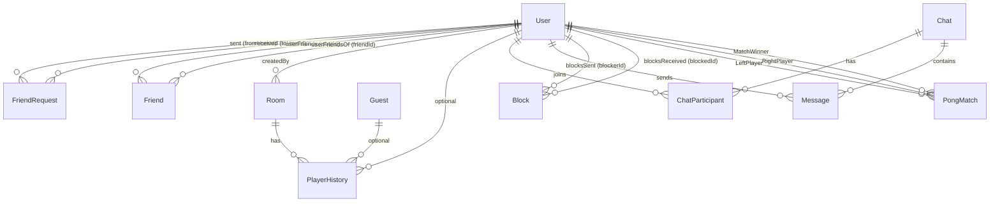

# PrismPlay

This project has been created as part of the 42 curriculum by <moel-fat>, <amokhtar>, <eel-brah>, <mboughra>, <muel-bak>.

## Description

ft_transcendence (PrismPlay) is a full-stack web application featuring real-time multiplayer Pong, offline Pong modes with AI, an Agar.io-style arena, social hub , and player profiles. It includes a frontend, backend, and database, runs via Docker, and is compatible with the latest stable Chrome.

## Key Features

- User authentication + profiles (avatar, stats, match history)
- Real-time Pong (online matchmaking, server-authoritative game state)
- Disconnection handling (pause + reconnection window)
- Game modes: local/AI + online multiplayer Pong
- Agario with rooms history and leaderboard
- Social hub: friends, requests, and chat

## Instructions

### Prerequisites

- Docker + Docker Compose
- `.env.production` file (see `.env_example`)

### Start

```bash
cp .env_example .env.production #fill the needed fieldsPong
docker compose up --build
```

### Access

- App (HTTPS): https://localhost:9443
- HTTP redirect: http://localhost:9000 → HTTPS

## Project Management

- Tools: github , Git
- Process: weekly sync, code reviews on critical PRs, shared Discord

## Team Information

| Member     | Role(s)  | Responsibilities                                             |
| ---------- | -------- | ------------------------------------------------------------ |
| <eel-bah>  | PO - Dev | vision, backlog, validation Dev, features, tests, docs       |
| <amokhtar> | PM - Dev | planning, blockers, deadlines ,Dev, features, tests, docs    |
| <moel-fat> | TL - Dev | architecture, standards, reviews ,Dev, features, tests, docs |
| <mboughra> | Dev      | features, tests, docs                                        |
| <meul-bak> | Dev      | validation Dev, features, tests, docs                        |

## Technical Stack

- Frontend: React + TypeScript, Vite, HTML5 Canvas, Tailwind CSS
- Backend: Node.js + Fastify, Socket.IO
- Database: MariaDB + Prisma ORM
- Deployment: Docker
- Others: zod, axios, bcrypt

## Why this stack

- React/TS for maintainable UI + safety
- Canvas for fast 2D rendering
- Socket.IO for real-time low-latency multiplayer
- Server-authoritative simulation for fairness
- Prisma for type-safe DB access
- Zod for validation

## System Architecture

### Client

- React UI for menus, matchmaking, HUD, profiles, and social features
- Canvas renderer at requestAnimationFrame for offline Pong
- Sends input only in online matches (up/down), no physics on client

### Server

- Authenticates sockets (JWT)
- Matchmaking queue → creates matches
- Broadcasts snapshots to clients

## Database Schema

We use **MariaDB** with **Prisma ORM**. The schema is centered around `User` accounts, social interactions (friends/blocks), chat (DMs + groups), and game tracking (Pong matches + room-based player history).

### ER Diagram (Mermaid)



### Tables / Models (Key Fields, Types, Relationships)

#### `User`

- **PK:** `id` (Int, auto-increment)
- **Unique:** `username` (String), `email` (String), `googleId` (String?)
- **Auth:** `passwordHash` (String?) for local users, `googleId` (String?) for OAuth
- Other: `avatarUrl` (String?), `createdAt` (DateTime), `lastLogin` (DateTime?)
- **Relations:** FriendRequests (sent/received), Friends (many-to-many), Rooms, PlayerHistory, PongMatches (left/right/winner), Messages, ChatParticipant, Blocks (sent/received)

#### `FriendRequest`

- **PK:** `id` (Int)
- **FKs:** `fromUserId` → User, `toUserId` → User
- `status` (enum FriendRequestStatus), `sentAt` (DateTime), `respondedAt` (DateTime?)
- **Constraints:** unique `(fromUserId, toUserId)`
- **Indexes:** `(toUserId, status)`, `(fromUserId, status)`

#### `Friend` (many-to-many join)

- **Composite PK:** `(userId, friendId)`
- **FKs:** `userId` → User, `friendId` → User
- `createdAt` (DateTime)
- **Indexes:** `userId`, `friendId`

#### `Block`

- **PK:** `id` (Int)
- **FKs:** `blockerId` → User, `blockedId` → User
- `createdAt` (DateTime)
- **Constraint:** unique `(blockerId, blockedId)`

#### `Chat`

- **PK:** `id` (Int)
- `isGroup` (Boolean), `title` (String?)
- **Relations:** participants via `ChatParticipant`, messages via `Message`

#### `ChatParticipant` (join)

- **Composite PK:** `(chatId, userId)`
- **FKs:** `chatId` → Chat, `userId` → User
- **Index:** `userId`

#### `Message`

- **PK:** `id` (Int)
- **FKs:** `senderId` → User, `chatId` (Int?) → Chat
- `channel` (String?), `content` (Text), `createdAt` (DateTime), `readAt` (DateTime?)
- **Indexes:** `(chatId, createdAt)`, `chatId`, `senderId`

#### `Room`

- **PK:** `id` (Int)
- `name` (String), `isDefault` (Boolean), `visibility` (String)
- Optional limits: `maxDurationMin` (Int?), `maxPlayers` (Int?)
- `startedAt` (DateTime), `endedAt` (DateTime?)
- **FK:** `createdById` (Int?) → User
- **Index:** `isDefault`

#### `Guest`

- **PK:** `id` (String, UUID)
- `createdAt` (DateTime), `lastSeen` (DateTime, auto-updated)
- **Relation:** PlayerHistory (one-to-many)

#### `PlayerHistory`

- **PK:** `id` (Int)
- **FKs:** `roomId` → Room, `userId` (Int?) → User, `guestId` (String?) → Guest
- Stats: `durationMs` (Int), `maxMass` (Int), `kills` (Int), `rank` (Int?), `isWinner` (Boolean)
- `name` (String), `createdAt` (DateTime)
- **Indexes:** `guestId`, `(roomId, createdAt)`, `(userId, createdAt)`

#### `PongMatch`

- **PK:** `id` (Int)
- **FKs:** `leftPlayerId` → User, `rightPlayerId` → User, `winnerId` → User
- Scores: `leftScore` (Int), `rightScore` (Int)
- `reason` (String), `duration` (Int?), `createdAt` (DateTime)

#### `RevokedToken`

- **PK:** `id` (Int)
- **Unique:** `token` (String)
- `revokedAt` (DateTime)

## Pong Implementation

### Game Loop

- Server tick: setInterval(..., 1000/60)
- Each tick: apply inputs → update physics → collision checks → score → snapshot emit

### Collision

- Uses swept collision to avoid tunneling at high ball speeds
- Treat movement as a segment and compute intersection time t ∈ [0..1]
- Resolve at collision point, then reflect velocity

### AI (offline)

- Predicts ball landing Y using time-to-reach + wall reflection
- Adds reaction delay and error to avoid perfect play

### Online Multiplayer Flow

- Client connects to /pong namespace (JWT)
- Server puts player in queue
- When 2 players available → create match + assign sides
- Countdown → playing → score → gameover
- Save result → update stats/history

### Disconnection Handling

- If connection loss → pause + reconnection timer
- If timeout → opponent wins
- Prevent race conditions with a single end-match lock

### for more Look at PongDuc in Documentation folder

## agario Implementation

### Engine & Game Loop
- Global Tick Loop: Uses a unified, recursive setTimeout loop running at exactly 50 ticks per second (TICK_RATE = 50), iterating
 synchronously through all active rooms in the worldByRoom Map to optimize server resources.
- State Interpolation: Includes an accumulator and a max-catchup step limit (MAX_CATCHUP_STEPS = 5) to ensure game physics remain perfectly stable even if the server lags briefly.
- State Broadcast: Emits a highly optimized heartbeat payload to clients containing serialized players, orbs, ejected mass, and viruses.

### Collision & Physics
- AABB & Circular Intersection: Calculates entity overlap using standard distance math (Math.hypot(dx, dy)).
- Strict Consumption Ratios: A cell can only consume another if it is 25% larger (SINGLE_EAT_FACTOR = 1.25). If the attacking player has split their cells, the penalty increases, requiring them to be 33% larger (SPLIT_EAT_FACTOR = 1.33).
- Friction & Decay: Ejected mass and split cells utilize realistic exponential decay functions (e.g., Math.exp(-EJECT_FRICTION * dt)) to simulate friction and gradually slow down across the map.

### Advanced Mechanics (Viruses & Ejecting)
- Virus Feeding: Players can eject mass (w key) into viruses. If a virus is fed 7 times (VIRUS_MAX_FEED = 7), it duplicates and
fires a new virus in the opposite direction at high speed.
- Virus Penalties: The engine tracks a 2-minute penalty window (VIRUS_PENALTY_WINDOW_MS = 120000). If a player consumes too many viruses within this window (VIRUS_EAT_THRESHOLD = 2), a harsh mass-decay multiplier (up to 6x) is applied to their cell.
- Cell Limits: Players can split up to a strict hard cap of 16 individual blobs (MAX_BLOBS_PER_PLAYER = 16).

### Room Management & Death Handling
- Host Migration: If the creator/host of a private room is eaten or disconnects, the engine dynamically reassigns the host role to another active user in the room.
- Database Integration: Upon a player's death, if their survival time meets the minimum logging threshold, the engine asynchronously saves their duration, max mass, kills, and identity directly to the PostgreSQL database (createPlayerHistoryDb).
- Room Finalization: Once a room's time limit is reached, the engine gracefully pauses physics, processes all final player saves, finalizes the room leaderboard, and cleanly flushes the room from server memory.

## Features List

User Authentication (amokhtar - moel-fat): Signup, login, JWT, OAuth (Google), token revocation, protected routes
User Profiles (amokhtar): Avatar upload, stats, achievements, match history
Real-time Multiplayer Pong (meol-fat - mboughra): Online matchmaking, server-authoritative game state, reconnection handling, match lifecycle, statistics, private matchmaking
Offline Pong Modes (moel-fat - eel-brah): Local multiplayer, AI opponent with adjustable difficulty
Agario (eel-brah): Real-time multiplayer, rooms, history, leaderboards, spectator mode
Social Hub (mboughra - muel-bak): Friends, friend requests, blocking, chat (DMs, channels), online status
Game Statistics (eel-brah - muel-bak): Player stats, match history, leaderboards
Privacy Policy & Terms of Service (): Dedicated pages
Database (eel-brah, mboughra): MariaDB with Prisma ORM
Deployment (meol-fat): Docker - Docker Compose
Advanced Chat Features (mboughra): Channels, DMs, typing indicators, message read status
Game Customization Options (moel-fat - muel-bak): Themes, settings
Global Leaderboards (eel-brah - mboughra - muel-bak): For Pong and Agario
Room History (eel-brah - muel-bak): Agario rooms history

## Modules (points)
Category | Module | Points
---      | ----------- | --26--
Web      | Frameworks frontend+backend | 2
Web      | Real-time features (WebSockets / Socket.IO) | 2
Web      | Allow users to interact with other users | 2
web      | Standard user management and authentication. | 2
Gaming   | Remote players (real-time multiplayer + reconnection) | 2
Gaming   | Multiplayer game (more than two players). | 2 
gaming   | Add another game with user history and matchmaking. | 2
AI       | AI Opponent (human-like, beatable) | 2
Gaming   | Web-based game (Pong) | 2
Web      | ORM (Prisma) | 1
Gaming   | Game statistics and match history | 1
web      | Implement remote authentication with OAuth 2.0  | 1
web      | Advanced chat features | 1
web      | Game customization options. | 1
web      | Implement spectator mode for games. | 1
web      | Full compatibility with at least 2 additional browsers | 1


## Individual Contributions

- <meol-fat>:
Contributions:
    - pong: Real-time multiplayer, local play, history, leaderboard, Reconnect Handling.
    - OAuth (Google):  
claimed modules:
    -Web-based game (Pong)
    - Remote players
    - Multiplayer game
    - OAuth (Google):
    - Game statistics and match history
    - Game customization options 
    - ORM (Prisma)
    - Frameworks backend
Notable problems solved:
    - Race conditions in matchmaking:
    - websocket reconnection
    - WebSocket disconnects & reconnection
    - Prisma migration/runtime issues

- <muel-bak>: - Frontend

Contributions:
- home/games landing UIs, UI state handling, social/profile pages, leaderboard UI social hub App shell
- navigation/routes, auth UI flows, responsive layout, visual polish
- Real-time chat (Global channels and private DMs)
- Friend system
claimed modules:
- Frameworks Frontend
- Advanced chat features
- ORM (Prisma)
- Full compatibility with at least 2 additional browsers
Notable problems solved:
- Prisma migration/runtime issues
- Frontend/backend message validation mismatches

<eel-brah>: 
Contributions:
    - Agario: Real-time multiplayer, rooms (public and private), history, leaderboard, spectator mode
    - Pong AI opponent
    - Fastify server setup
claimed modules:
    - Remote players
    - Multiplayer game
    - Add another game with user history and matchmaking
    - AI Opponent 
    - ORM (Prisma)
    - Game statistics and match history 
    - Implement spectator mode for games
    - Frameworks backend
Notable problems solved:
    - Race conditions
    - websocket reconnection

<mboughra>:
Contributions:
- Real-time chat (Global channels and private DMs)
- Friend and block system
- Live typing indicators and unread message receipts
- Private game matchmaking (secure 1v1 lobby invites)
- Database schema design and queries using Prisma
claimed modules:
- User interaction
- Frameworks backend
- Frameworks Frontend
- Advanced chat features
- ORM (Prisma)
Notable problems solved:
- Game invite race conditions and spam
- Frontend/backend message validation mismatches

<Member C>: …

(Include concrete features + files/components owned.)

## Resources

### References

- React docs, TypeScript handbook, MDN Canvas, Socket.IO docs, Prisma docs, fastify docs, Oauth 2.0,

#### Links

- https://fastify.dev/docs/latest/Guides/Getting-Started/
- https://react.dev/learn
- https://www.prisma.io/docs
- https://oauth.net/2/
- https://developer.mozilla.org/en-US/docs/Web/HTML
- https://developer.mozilla.org/en-US/docs/Web/API/Canvas_API/Tutorial
- https://docs.docker.com/
- https://zod.dev/basics

### AI Usage

- Used AI for: documentation rewriting, debugging explanations, refactoring suggestions and ideas
- Not used to blindly generate core logic; all generated content was reviewed and understood by the team
