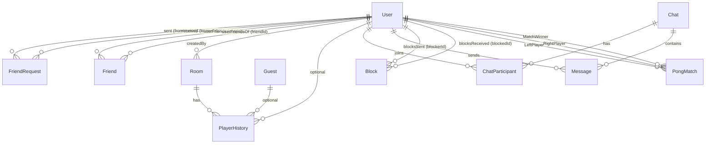

# PrismPlay

This project has been created as part of the 42 curriculum by <moel-fat>, <amokhtar>, <eel-brah>, <mboughra>, <muel-bak>.

## Description

ft_transcendence (PrismPlay) is a full-stack web application featuring real-time multiplayer Pong, offline Pong modes with AI, an Agar.io-style arena, social hub , and player profiles. It includes a frontend, backend, and database, runs via Docker, and is compatible with the latest stable Chrome.

## Key Features

- User authentication + profiles (avatar, stats, match history)
- Real-time Pong (online matchmaking, server-authoritative game state)
- Disconnection handling (pause + reconnection window)
- Game modes: local/AI + online multiplayer Pong
- Agar.io arena with rooms history and leaderboards
- Social hub: friends, requests, and chat

## Instructions

### Prerequisites

- Docker + Docker Compose
- `.env.production` file (see `.env_example`)

### Start

```bash
cp .env_example .env.production #fill the needed fields
docker compose up --build
```

### Access

- App (HTTPS): https://localhost:9443
- HTTP redirect: http://localhost:9000 → HTTPS

## Project Management

- Tools: github , Git
- Process: weekly sync, code reviews on critical PRs, shared Discord

## Team Information

| Member     | Role(s)  | Responsibilities                                             |
| ---------- | -------- | ------------------------------------------------------------ |
| <eel-bah>  | PO - Dev | vision, backlog, validation Dev, features, tests, docs       |
| <amokhtar> | PM - Dev | planning, blockers, deadlines ,Dev, features, tests, docs    |
| <mboughra> | TL - Dev | architecture, standards, reviews ,Dev, features, tests, docs |
| <moel-fat> | Dev      | features, tests, docs                                        |
| <meul-bak> | Dev      | features, tests, docs                                        |

## Technical Stack

- Frontend: React + TypeScript, Vite, HTML5 Canvas, Tailwind CSS.
- Backend: Node.js + Fastify, Socket.IO.
- Database: MariaDB + Prisma ORM.
- Deployment: Docker .
- Others: zod, axios, bcrypt,

## Why this stack

- React/TS for maintainable UI + safety
- Canvas for fast 2D rendering
- Socket.IO for real-time low-latency multiplayer
- Server-authoritative simulation for fairness
- Prisma for type-safe DB access
- Zod for validation

## System Architecture

### Client

- React UI for menus, matchmaking, HUD, profiles, and social features
- Canvas renderer at requestAnimationFrame for offline Pong
- Sends input only in online matches (up/down), no physics on client

### Server

- Authenticates sockets (JWT)
- Matchmaking queue → creates matches
- Broadcasts snapshots to clients

## Database Schema

We use **MariaDB** with **Prisma ORM**. The schema is centered around `User` accounts, social interactions (friends/blocks), chat (DMs + groups), and game tracking (Pong matches + room-based player history).

### ER Diagram (Mermaid)



### Tables / Models (Key Fields, Types, Relationships)

#### `User`

- **PK:** `id` (Int, auto-increment)
- **Unique:** `username` (String), `email` (String), `googleId` (String?)
- **Auth:** `passwordHash` (String?) for local users, `googleId` (String?) for OAuth
- Other: `avatarUrl` (String?), `createdAt` (DateTime), `lastLogin` (DateTime?)
- **Relations:** FriendRequests (sent/received), Friends (many-to-many), Rooms, PlayerHistory, PongMatches (left/right/winner), Messages, ChatParticipant, Blocks (sent/received)

#### `FriendRequest`

- **PK:** `id` (Int)
- **FKs:** `fromUserId` → User, `toUserId` → User
- `status` (enum FriendRequestStatus), `sentAt` (DateTime), `respondedAt` (DateTime?)
- **Constraints:** unique `(fromUserId, toUserId)`
- **Indexes:** `(toUserId, status)`, `(fromUserId, status)`

#### `Friend` (many-to-many join)

- **Composite PK:** `(userId, friendId)`
- **FKs:** `userId` → User, `friendId` → User
- `createdAt` (DateTime)
- **Indexes:** `userId`, `friendId`

#### `Block`

- **PK:** `id` (Int)
- **FKs:** `blockerId` → User, `blockedId` → User
- `createdAt` (DateTime)
- **Constraint:** unique `(blockerId, blockedId)`

#### `Chat`

- **PK:** `id` (Int)
- `isGroup` (Boolean), `title` (String?)
- **Relations:** participants via `ChatParticipant`, messages via `Message`

#### `ChatParticipant` (join)

- **Composite PK:** `(chatId, userId)`
- **FKs:** `chatId` → Chat, `userId` → User
- **Index:** `userId`

#### `Message`

- **PK:** `id` (Int)
- **FKs:** `senderId` → User, `chatId` (Int?) → Chat
- `channel` (String?), `content` (Text), `createdAt` (DateTime), `readAt` (DateTime?)
- **Indexes:** `(chatId, createdAt)`, `chatId`, `senderId`

#### `Room`

- **PK:** `id` (Int)
- `name` (String), `isDefault` (Boolean), `visibility` (String)
- Optional limits: `maxDurationMin` (Int?), `maxPlayers` (Int?)
- `startedAt` (DateTime), `endedAt` (DateTime?)
- **FK:** `createdById` (Int?) → User
- **Index:** `isDefault`

#### `Guest`

- **PK:** `id` (String, UUID)
- `createdAt` (DateTime), `lastSeen` (DateTime, auto-updated)
- **Relation:** PlayerHistory (one-to-many)

#### `PlayerHistory`

- **PK:** `id` (Int)
- **FKs:** `roomId` → Room, `userId` (Int?) → User, `guestId` (String?) → Guest
- Stats: `durationMs` (Int), `maxMass` (Int), `kills` (Int), `rank` (Int?), `isWinner` (Boolean)
- `name` (String), `createdAt` (DateTime)
- **Indexes:** `guestId`, `(roomId, createdAt)`, `(userId, createdAt)`

#### `PongMatch`

- **PK:** `id` (Int)
- **FKs:** `leftPlayerId` → User, `rightPlayerId` → User, `winnerId` → User
- Scores: `leftScore` (Int), `rightScore` (Int)
- `reason` (String), `duration` (Int?), `createdAt` (DateTime)

#### `RevokedToken`

- **PK:** `id` (Int)
- **Unique:** `token` (String)
- `revokedAt` (DateTime)

## Pong Implementation

### Game Loop

- Server tick: setInterval(..., 1000/60)
- Each tick: apply inputs → update physics → collision checks → score → snapshot emit

### Collision

- Uses swept collision to avoid tunneling at high ball speeds
- Treat movement as a segment and compute intersection time t ∈ [0..1]
- Resolve at collision point, then reflect velocity

### AI (offline)

- Predicts ball landing Y using time-to-reach + wall reflection
- Adds reaction delay and error to avoid perfect play

### Online Multiplayer Flow

- Client connects to /pong namespace (JWT)
- Server puts player in queue
- When 2 players available → create match + assign sides
- Countdown → playing → score → gameover
- Save result → update stats/history

### Disconnection Handling

- If connection loss → pause + reconnection timer
- If timeout → opponent wins
- Prevent race conditions with a single end-match lock

### for more Look at PongDuc in Documentation folder

## agario Implementation

## Features List

<!-- - Auth (signup/login), JWT, protected routes — Profiles + avatar upload — <amokhtar>
- Pong Matchmaking queue + match lifecycle — Server-authoritative Pong engine - Client canvas renderer + input handler — <moel-fat>
- Stats + match history persistence — <member>
- Agar.io rooms + history/leaderboard — <member>
- Privacy Policy + Terms of Service pages — <member> -->

## Modules (points) (edit to match what you truly implemented)

<!-- Category | Module | Points
--- | --- | ---
Web | Frameworks frontend+backend | 2
Web | Real-time features (WebSockets / Socket.IO) | 2
Gaming | Web-based game (Pong) | 2
Gaming | Remote players (real-time multiplayer + reconnection) | 2
AI | AI Opponent (human-like, beatable) | 2
User Mgmt | Standard user management (profile, avatar, etc.) | 2
Web | ORM (Prisma) | 1
User Mgmt | Game stats + match history | 1
Gaming | Game customization (themes/settings) | 1 -->

## Individual Contributions (required)

### - <meol-fat>: - Dev

Owned features: Pong (local multiplay) matchmaking reconect history leaderboard Oauth(google)
Key modules claimed:
Main files/areas: /src /frontend(component/pong* - game/pong* - utils) , /backend(server/socket pong.ts pongserver.ts - module/pong) , /shared/pong\* , psirma
Notable problems solved: (e.g., race condition, websocket disconnect handling, Prisma migration issue)

- <Member B>: …
- <Member C>: …
- <Member D>: …

(Include concrete features + files/components owned.)

## Resources

### References

- React docs, TypeScript handbook, MDN Canvas, Socket.IO docs, Prisma docs, fastify docs, Oauth 2.0,

#### Links

- https://fastify.dev/docs/latest/Guides/Getting-Started/
- https://react.dev/learn
- https://www.prisma.io/docs
- https://oauth.net/2/
- https://developer.mozilla.org/en-US/docs/Web/HTML
- https://developer.mozilla.org/en-US/docs/Web/API/Canvas_API/Tutorial
- https://docs.docker.com/
- https://zod.dev/basics

### AI Usage

- Used AI for: documentation rewriting, debugging explanations, refactoring suggestions and ideas
- Not used to blindly generate core logic; all generated content was reviewed and understood by the team
